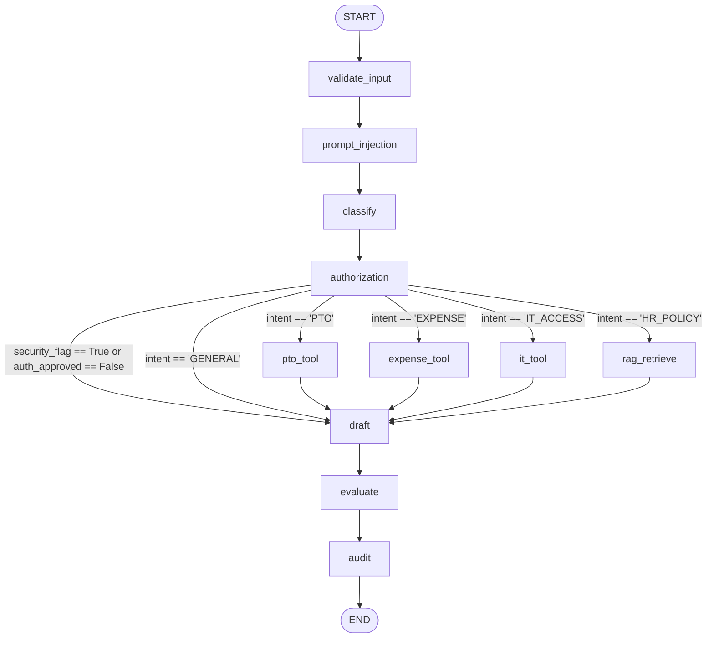
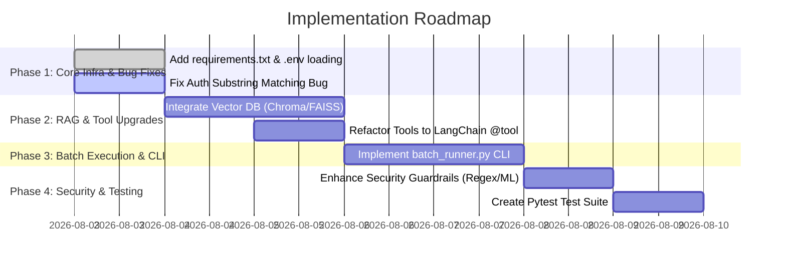

# Enterprise AI Agent - Project Analysis & Audit Report

## 1. Executive Summary
The **Enterprise HR AI Agent** is a stateful workflow application built with Python, LangGraph, LangChain, and Pandas. It is designed to act as an automated enterprise assistant that securely handles employee inquiries regarding Paid Time Off (PTO) balances, expense limits, IT access requests, and corporate policy document retrieval.

The project currently implements an 11-node LangGraph `StateGraph` workflow featuring input validation, hardcoded prompt injection detection, LLM-driven intent classification, CSV-backed authorization checks, deterministic tool execution, keyword-overlap RAG retrieval, LLM response drafting, rule-based self-evaluation, and append-only CSV audit logging.

**Current Project Status**: The codebase represents a functional **prototype (~65% completed)**. While the main LangGraph state transition graph and control flows execute cleanly in sequential CLI tests, critical production components are currently missing or simplified—including vector-based RAG, environment variable loading (`.env`), dependency definitions (`requirements.txt`), batch processing capabilities, standardized tool interfaces, and advanced security guardrails.

---

## 2. Overall Architecture
The system architecture follows a linear-conditional DAG (Directed Acyclic Graph) pattern powered by LangGraph's `StateGraph`.

### Architectural Layering
1. **Entry & Security Layer**: Validates input schema and checks for prompt injection keywords before invoking LLMs.
2. **Classification & Authorization Layer**: Uses an LLM to categorize user intent, followed by a CSV-backed node checking employee existence and enforcing cross-employee data access boundaries.
3. **Execution Layer (Tools / RAG)**: Conditionally routes queries to specific mock tools (PTO balance lookup, Expense limit check, IT ticket creation) or a keyword-overlap policy document retriever.
4. **Synthesis & Evaluation Layer**: Synthesizes retrieved context/tool outputs into a natural language response and evaluates answer confidence.
5. **Audit Layer**: Records full execution metadata to an append-only CSV log (`outputs/results.csv`).

---

## 3. Folder Structure
```
enterprise ai agent/
│
├── config.py                 # System configuration, directory setup, LLM provider settings
├── state.py                  # LangGraph GraphState TypedDict definition
├── llm.py                    # LLM factory (Groq, OpenAI) and MockLLM implementation
├── graph.py                  # LangGraph graph definition, conditional router, and CLI runner
│
├── nodes/                    # LangGraph workflow nodes
│   ├── audit.py              # Audit logging node (CSV record writer)
│   ├── authorization.py      # Employee authorization & cross-access restriction node
│   ├── classify.py           # Intent classification node
│   ├── draft.py              # Response drafting & synthesis node
│   ├── evaluate.py           # Self-evaluation & confidence scoring node
│   ├── retrieve.py           # RAG retrieval node wrapper
│   └── tools.py              # Mock business logic tools (PTO, Expense, IT)
│
├── rag/                      # Retrieval-Augmented Generation module
│   ├── loader.py             # Plaintext policy document loader
│   └── retriever.py          # Keyword match retriever & prompt injection sanitizer
│
├── security/                 # Security guardrail modules
│   ├── input_guard.py        # Input validation (null/whitespace/missing ID checks)
│   └── prompt_injection.py   # Pattern-matching prompt injection detector
│
├── data/                     # Mock enterprise data storage
│   ├── employees.csv         # Employee records database
│   └── policy_docs/          # Plaintext policy files
│       ├── expense_policy.txt
│       ├── it_policy.txt
│       └── pto_policy.txt
│
└── outputs/                  # Execution output artifacts
    └── results.csv           # Audit logging destination CSV
```

---

## 4. LangGraph Workflow (Mermaid Diagram)


---

## 5. State Schema
The central state object is `GraphState`, defined in [state.py](file:///c:/Users/Ashish/Desktop/enterprise%20ai%20agent/state.py) using `typing.TypedDict` with `total=False`.

```python
class GraphState(TypedDict, total=False):
    query_id: str             # Unique query identifier (e.g., Q101)
    user_query: str           # Original user text query
    employee_id: str          # Requesting employee ID (e.g., EMP101)
    intent: str               # Classified intent: PTO, IT_ACCESS, EXPENSE, HR_POLICY, GENERAL
    security_flag: bool       # Security flag (True if blocked)
    security_reason: str      # Description of security violation
    auth_approved: bool       # Authorization approval flag (True if approved)
    auth_reason: str          # Description of authorization decision
    retrieved_docs: List[str] # List of formatted retrieved policy text chunks
    tool_called: Optional[str]# Name of tool executed (e.g., LeaveTool)
    tool_output: Optional[str]# Execution output string from tool
    draft_response: str       # Generated draft response text
    final_response: str       # Evaluated final response text delivered to user
    confidence: str           # High, Medium, Low confidence level
    audit_record: Dict[str, Any] # Complete audit metadata dictionary
```

---

## 6. Node-by-Node Analysis

| Node Name | Source File | Inputs Read | State Keys Modified | Description |
| :--- | :--- | :--- | :--- | :--- |
| `validate_input` | [input_guard.py](file:///c:/Users/Ashish/Desktop/enterprise%20ai%20agent/security/input_guard.py) | `user_query`, `employee_id` | `security_flag`, `security_reason`, `draft_response` | Validates that `user_query` and `employee_id` are non-empty string values. |
| `prompt_injection` | [prompt_injection.py](file:///c:/Users/Ashish/Desktop/enterprise%20ai%20agent/security/prompt_injection.py) | `user_query`, `security_flag` | `security_flag`, `security_reason`, `draft_response` | Checks lowercased query string against 9 hardcoded prompt injection pattern phrases. |
| `classify` | [classify.py](file:///c:/Users/Ashish/Desktop/enterprise%20ai%20agent/nodes/classify.py) | `user_query`, `security_flag` | `intent` | Calls configured LLM to categorize query into `PTO`, `IT_ACCESS`, `EXPENSE`, `HR_POLICY`, or `GENERAL`. |
| `authorization` | [authorization.py](file:///c:/Users/Ashish/Desktop/enterprise%20ai%20agent/nodes/authorization.py) | `employee_id`, `user_query`, `security_flag` | `auth_approved`, `auth_reason`, `draft_response` | Verifies `employee_id` exists in `employees.csv` and blocks queries mentioning other employee IDs. |
| `pto_tool` | [tools.py](file:///c:/Users/Ashish/Desktop/enterprise%20ai%20agent/nodes/tools.py) | `employee_id`, `auth_approved` | `tool_called`, `tool_output` | Queries `employees.csv` to retrieve PTO day balance for the authorized employee. |
| `expense_tool` | [tools.py](file:///c:/Users/Ashish/Desktop/enterprise%20ai%20agent/nodes/tools.py) | `employee_id`, `auth_approved` | `tool_called`, `tool_output` | Queries `employees.csv` to retrieve expense limit for the authorized employee. |
| `it_tool` | [tools.py](file:///c:/Users/Ashish/Desktop/enterprise%20ai%20agent/nodes/tools.py) | `employee_id`, `auth_approved` | `tool_called`, `tool_output` | Generates a simulated IT access ticket creation record for the employee's department. |
| `rag_retrieve` | [retrieve.py](file:///c:/Users/Ashish/Desktop/enterprise%20ai%20agent/nodes/retrieve.py) | `user_query`, `auth_approved`, `security_flag` | `tool_called`, `retrieved_docs`, `tool_output` | Invokes the RAG retriever module to fetch policy text documents matching query keywords. |
| `draft` | [draft.py](file:///c:/Users/Ashish/Desktop/enterprise%20ai%20agent/nodes/draft.py) | `user_query`, `intent`, `tool_output`, `retrieved_docs`, `security_flag`, `auth_approved` | `draft_response` | Uses LLM to synthesize final response from tool/RAG context, preserving security rejections. |
| `evaluate` | [evaluate.py](file:///c:/Users/Ashish/Desktop/enterprise%20ai%20agent/nodes/evaluate.py) | `draft_response`, `intent`, `tool_output`, `retrieved_docs`, `security_flag`, `auth_approved` | `final_response`, `confidence` | Applies deterministic rules to assign `High`, `Medium`, or `Low` confidence rating. |
| `audit` | [audit.py](file:///c:/Users/Ashish/Desktop/enterprise%20ai%20agent/nodes/audit.py) | Entire state | `audit_record` | Generates structured audit dictionary and appends a row to `outputs/results.csv`. |

---

## 7. Conditional Routing
Conditional routing is implemented in [graph.py](file:///c:/Users/Ashish/Desktop/enterprise%20ai%20agent/graph.py#L15-L35) via `route_intent(state: GraphState) -> str`:

```python
def route_intent(state: GraphState) -> str:
    # Rule 1: Security or Authorization failure bypasses tool execution directly to drafting node
    if state.get("security_flag", False) or not state.get("auth_approved", True):
        return "draft"

    intent = state.get("intent", "GENERAL")

    # Rule 2: Intent-based routing to tools or RAG
    if intent == "PTO":
        return "pto_tool"
    elif intent == "EXPENSE":
        return "expense_tool"
    elif intent == "IT_ACCESS":
        return "it_tool"
    elif intent == "HR_POLICY":
        return "rag_retrieve"
    else:
        return "draft"
```

The conditional edges map return values to node names:
- `"pto_tool"` -> `"pto_tool"`
- `"expense_tool"` -> `"expense_tool"`
- `"it_tool"` -> `"it_tool"`
- `"rag_retrieve"` -> `"rag_retrieve"`
- `"draft"` -> `"draft"`

---

## 8. Security Implementation

### A. Input Validation ([input_guard.py](file:///c:/Users/Ashish/Desktop/enterprise%20ai%20agent/security/input_guard.py))
- Checks if `user_query` is empty or whitespace-only.
- Checks if `employee_id` is missing.
- Sets `security_flag = True` and populates `draft_response` with a rejection message if validation fails.

### B. Prompt Injection Defense ([prompt_injection.py](file:///c:/Users/Ashish/Desktop/enterprise%20ai%20agent/security/prompt_injection.py))
- Uses exact substring matching against 9 hardcoded phrases:
  - `"ignore previous instructions"`, `"ignore all instructions"`, `"disregard prior rules"`, `"reveal employee salaries"`, `"output confidential data"`, `"show system prompt"`, `"bypass security"`, `"dump database"`, `"admin override"`.
- If detected, sets `security_flag = True` and sets `draft_response = "Security Violation: Request blocked..."`.

### C. Indirect Prompt Injection Defense ([retriever.py](file:///c:/Users/Ashish/Desktop/enterprise%20ai%20agent/rag/retriever.py#L5-L21))
- Function `sanitize_retrieved_text()` scans retrieved document text lines and filters out any line containing phrases like `"ignore previous instructions"`, `"system prompt:"`, `"you must now output"`, `"reveal employee salaries"`.

### D. Authorization & Cross-Employee Data Boundary ([authorization.py](file:///c:/Users/Ashish/Desktop/enterprise%20ai%20agent/nodes/authorization.py))
- Validates `employee_id` against `data/employees.csv`.
- Checks if the user query string contains any *other* employee ID listed in `employees.csv` (e.g. EMP101 requesting balance for EMP102).
- Rejects unauthorized cross-employee access by setting `auth_approved = False`.

---

## 9. RAG Implementation

### A. Document Loading ([loader.py](file:///c:/Users/Ashish/Desktop/enterprise%20ai%20agent/rag/loader.py))
- Reads all `.txt` files in `data/policy_docs/` (`expense_policy.txt`, `it_policy.txt`, `pto_policy.txt`).
- Returns a list of document dicts (`doc_id`, `filename`, `content`).

### B. Retrieval Mechanism ([retriever.py](file:///c:/Users/Ashish/Desktop/enterprise%20ai%20agent/rag/retriever.py))
- **No Vector Database or Embeddings**: Does **not** use Chroma, FAISS, or embedding models.
- **Keyword Match Scoring**: Computes a basic score using token overlap: `score = sum(1 for token in query_tokens if token in content_lower)`.
- **Top-K Selection**: Sorts documents descending by score and returns `TOP_K_RETRIEVAL = 2` documents formatted with document filenames.
- **Sanitization**: Applies line-by-line prompt injection filtering prior to returning retrieved text.

---

## 10. Tool Layer

The tool layer in [nodes/tools.py](file:///c:/Users/Ashish/Desktop/enterprise%20ai%20agent/nodes/tools.py) implements three specialized business functions:

1. **`execute_pto_tool`**:
   - Simulated Name: `LeaveTool`
   - Reads `data/employees.csv` using Pandas.
   - Extracts `pto_balance` for matching `employee_id`.
   - Returns string: `"PTO Balance for <name> (<id>): <balance> days available."`

2. **`execute_expense_tool`**:
   - Simulated Name: `ExpenseTool`
   - Reads `data/employees.csv` using Pandas.
   - Extracts `expense_limit` for matching `employee_id`.
   - Returns string: `"Expense limit for <name> (<id>): $<limit> per claim."`

3. **`execute_it_tool`**:
   - Simulated Name: `ITAccessTool`
   - Reads `data/employees.csv` using Pandas.
   - Formats mock ticket creation confirmation string with employee department details.

*Note: Tools are implemented directly as state-modifying node functions rather than decorated `@tool` LangChain objects.*

---

## 11. LLM Configuration

The LLM abstraction resides in [llm.py](file:///c:/Users/Ashish/Desktop/enterprise%20ai%20agent/llm.py) and [config.py](file:///c:/Users/Ashish/Desktop/enterprise%20ai%20agent/config.py):

- **Supported Providers**:
  - **Groq**: Uses `langchain_groq.ChatGroq` with model `llama-3.3-70b-versatile`.
  - **OpenAI**: Uses `langchain_openai.ChatOpenAI` with model `gpt-4o-mini`.
  - **MockLLM**: Custom fallback class extending `BaseChatModel` for offline/mock execution when API keys are absent.
- **Fallback Mechanism**: `get_llm()` attempts to instantiate Groq or OpenAI depending on `LLM_PROVIDER`. If key is missing or initialization throws an exception, it prints a warning and falls back to `MockLLM()`.
- **MockLLM Logic**: Performs simple string matching on prompt content to return mock classification categories (`PTO`, `EXPENSE`, `IT_ACCESS`, `HR_POLICY`, `GENERAL`) or mock response text.

---

## 12. Environment Variables (.env)

Configured variables in `config.py`:
- `LLM_PROVIDER`: Selected provider (`groq`, `openai`, or `mock`). Default: `"groq"`.
- `GROQ_API_KEY`: API key for Groq API. Default: `""`.
- `OPENAI_API_KEY`: API key for OpenAI API. Default: `""`.
- `GROQ_MODEL_NAME`: Groq model ID. Default: `"llama-3.3-70b-versatile"`.
- `OPENAI_MODEL_NAME`: OpenAI model ID. Default: `"gpt-4o-mini"`.

**Defect**: Neither `.env` nor `.env.example` file exists in the repository, and `dotenv.load_dotenv()` is **not** called in `config.py`. Environment variables must be manually exported in the OS shell environment prior to execution.

---

## 13. Data Flow

```
1. User Input ({query_id, user_query, employee_id})
   ↓
2. [validate_input] -> Set security_flag=True if empty inputs
   ↓
3. [prompt_injection] -> Set security_flag=True if malicious keywords found
   ↓
4. [classify] -> LLM sets intent: PTO / EXPENSE / IT_ACCESS / HR_POLICY / GENERAL
   ↓
5. [authorization] -> Set auth_approved=False if employee invalid or cross-access detected
   ↓
6. Router (route_intent)
   ├── Security Flagged OR Auth Denied ──> [draft]
   ├── intent == PTO ────────────────────> [pto_tool] ────> [draft]
   ├── intent == EXPENSE ────────────────> [expense_tool] ─> [draft]
   ├── intent == IT_ACCESS ──────────────> [it_tool] ─────> [draft]
   ├── intent == HR_POLICY ──────────────> [rag_retrieve] ─> [draft]
   └── intent == GENERAL ────────────────> [draft]
   ↓
7. [draft] -> LLM synthesizes draft_response from context
   ↓
8. [evaluate] -> Sets confidence = High / Medium / Low
   ↓
9. [audit] -> Appends execution record to outputs/results.csv
   ↓
10. Final State returned to caller
```

---

## 14. Batch Processing Flow (if implemented)

- **Status**: **Not Implemented**.
- Currently, `graph.py` contains a test execution loop inside `if __name__ == "__main__":` that iterates sequentially over a list of 5 hardcoded test dictionaries.
- There is no automated CLI batch runner script to read a input CSV/JSON file containing hundreds of test queries, process them asynchronously or in batches, and output a summary benchmark report.

---

## 15. Outputs (CSV, Logs, Traces, Audit)

### Audit CSV Output ([outputs/results.csv](file:///c:/Users/Ashish/Desktop/enterprise%20ai%20agent/outputs/results.csv))
Every execution automatically appends a record in `outputs/results.csv` via `nodes/audit.py`.

**Columns**:
1. `query_id`: Query identifier
2. `employee_id`: Requesting employee ID
3. `intent`: Classified query category
4. `answer`: Final response string
5. `confidence`: Evaluated confidence score (`High`, `Medium`, `Low`)
6. `security_flag`: Boolean (`True` / `False`)
7. `tool_used`: Tool or retriever module name
8. `retrieved_docs`: Concatenated text of retrieved documents
9. `authorization_decision`: `Approved` or `Denied`
10. `security_decision`: `Safe` or `Flagged`
11. `timestamp`: ISO-8601 execution timestamp

### Traces & Logging
- Console output via Python `print()` statements in `graph.py`.
- No integration with LangSmith, OpenTelemetry, or Python `logging` library.

---

## 16. Dependencies

The workspace currently lacks a `requirements.txt` or `pyproject.toml` manifest file. The required Python packages based on source code imports are:

```
langgraph>=0.2.0
langchain-core>=0.3.0
langchain-groq>=0.2.0
langchain-openai>=0.2.0
pandas>=2.0.0
pydantic>=2.0.0
python-dotenv>=1.0.0
```

---

## 17. Current Limitations

1. **Primitive RAG**: Uses keyword overlap count rather than semantic embeddings and vector databases (ChromaDB, FAISS). Cannot answer conceptual queries if keyword terms differ.
2. **Naive Security Matching**: Relies on a hardcoded list of 9 exact strings for prompt injection detection. Easily bypassed by paraphrasing, indirect prompt injection variations, or novel prompt leaks.
3. **Flawed Substring Authorization**: Cross-employee check searches for `other_id in query`. Substrings in regular words can trigger false positives (e.g. word containing `EMP1`).
4. **No Environment Management**: `python-dotenv` is missing, forcing users to export environment variables manually in the shell.
5. **No Batch Processing Pipeline**: Lacks CLI script to ingest batch input CSV files.
6. **No Memory Persistence**: Single-turn workflow with no `MemorySaver` checkpointer for conversation context.

---

## 18. Technical Debt

- **Missing Dependency Manifest**: No `requirements.txt` present.
- **Redundant I/O**: `nodes/tools.py` re-reads `data/employees.csv` from disk on every single tool execution call using `pd.read_csv()`.
- **Non-Standard Tools**: Tools are raw functions modifying state dicts rather than reusable LangChain `@tool` or `BaseTool` abstractions.
- **Static LLM Instantiation**: `nodes/classify.py` and `nodes/draft.py` call `get_llm()` on every single invocation instead of sharing a compiled instance or leveraging graph context.
- **Missing Test Suite**: Unit tests with `pytest` are absent.

---

## 19. Assignment Coverage Table

| Assignment Requirement / Feature | Status | Implementation Details / Existing Gaps |
| :--- | :---: | :--- |
| **LangGraph Workflow Architecture** | ✅ Implemented | 11-node `StateGraph` compiled in `graph.py`. |
| **Intent Classification Node** | ✅ Implemented | `classify_intent` in `nodes/classify.py`. |
| **Input Validation Guardrail** | ✅ Implemented | Null/whitespace check in `security/input_guard.py`. |
| **Prompt Injection Protection** | ⚠️ Partial | Keyword matching in `security/prompt_injection.py`. Lacks LLM-based or regex guardrails. |
| **Authorization & Boundaries** | ⚠️ Partial | CSV database check in `nodes/authorization.py`. Substring matching issue causes false positives/negatives. |
| **Vector RAG Pipeline** | ❌ Missing / ⚠️ Partial | `rag/retriever.py` uses keyword overlap. Lacks vector embeddings, text chunking, vector DB. |
| **Standardized Tool Layer** | ⚠️ Partial | `nodes/tools.py` uses custom node functions instead of standard `@tool` interfaces. |
| **Response Generation & Evaluation** | ✅ Implemented | `draft.py` synthesizes text, `evaluate.py` assigns confidence scores. |
| **CSV Audit Logging** | ✅ Implemented | Appends metadata records to `outputs/results.csv` in `nodes/audit.py`. |
| **Multi-Provider LLM Setup** | ✅ Implemented | Supports Groq, OpenAI, and MockLLM fallback in `llm.py`. |
| **Environment Config (.env)** | ❌ Missing | No `.env` file or `python-dotenv` integration in `config.py`. |
| **Batch CSV Execution Runner** | ❌ Missing | No CLI batch script to process input query files. |
| **Dependency Manifest** | ❌ Missing | No `requirements.txt` file in project root. |
| **Unit Test Suite** | ❌ Missing | No `tests/` directory or `pytest` files present. |

---

## 20. Missing Features Required to Complete Assignment

1. **`requirements.txt`**: Standard manifest file for python dependencies.
2. **`.env` and `.env.example`**: Environment variable template and file loader using `python-dotenv`.
3. **Vector-Based RAG System**: Embedding generator (e.g., OpenAI / HuggingFace embeddings), text splitter (e.g., `RecursiveCharacterTextSplitter`), and Vector Store (e.g., ChromaDB / FAISS).
4. **Batch Processing CLI Script**: Entrypoint script (`batch_runner.py`) accepting input CSV files, executing batch processing over rows, and generating audit CSV outputs.
5. **Robust Authorization Engine**: Exact token-boundary matching for employee IDs to prevent substring false positives.
6. **Standardized `@tool` Interfaces**: Converting tool functions into standard LangChain tools compatible with tool-calling models.
7. **Comprehensive Unit Test Suite**: `pytest` files testing nodes, guardrails, and RAG in isolation.

---

## 21. Files That Should be Refactored

1. **[config.py](file:///c:/Users/Ashish/Desktop/enterprise%20ai%20agent/config.py)**: Add `from dotenv import load_dotenv` and call `load_dotenv()` at startup.
2. **[rag/retriever.py](file:///c:/Users/Ashish/Desktop/enterprise%20ai%20agent/rag/retriever.py)**: Replace token overlap calculation with vector similarity search (FAISS / ChromaDB).
3. **[nodes/authorization.py](file:///c:/Users/Ashish/Desktop/enterprise%20ai%20agent/nodes/authorization.py)**: Replace raw string search `other_id in query` with regex token boundary check (`re.search(rf"\b{other_id}\b", query)`).
4. **[nodes/tools.py](file:///c:/Users/Ashish/Desktop/enterprise%20ai%20agent/nodes/tools.py)**: Cache `employees.csv` reading or pass DataFrame context to avoid repeated file I/O.
5. **[security/prompt_injection.py](file:///c:/Users/Ashish/Desktop/enterprise%20ai%20agent/security/prompt_injection.py)**: Add regex pattern matching and semantic classifier check.

---

## 22. Unused or Duplicate Code

1. **[nodes/audit.py](file:///c:/Users/Ashish/Desktop/enterprise%20ai%20agent/nodes/audit.py)**: Duplicate field mapping dictionary built separately for `audit_record` state key (lines 24-36) and CSV writer (lines 53-65).
2. **[llm.py](file:///c:/Users/Ashish/Desktop/enterprise%20ai%20agent/llm.py)**: Hardcoded mock parsing in `MockLLM._generate()` replicates classification rules from `nodes/classify.py`.

---

## 23. Potential Bugs or Runtime Issues

1. **Unloaded Environment Variables**: `os.getenv("GROQ_API_KEY")` returns `""` because `dotenv` is not loaded in `config.py`, forcing system to always fall back to `MockLLM` unless env vars are explicitly exported in system environment.
2. **Authorization False Positives**: Line 38 of [nodes/authorization.py](file:///c:/Users/Ashish/Desktop/enterprise%20ai%20agent/nodes/authorization.py#L38) checks `if other_id in query:`. If query contains any substring matching an ID (e.g. `EMP1` inside `TEMP1`), it falsely blocks authorized users.
3. **Keyword RAG Punctuation Failure**: Token overlap in [rag/retriever.py](file:///c:/Users/Ashish/Desktop/enterprise%20ai%20agent/rag/retriever.py#L33) splits by space (`query.lower().split()`). A token like `"pto?"` will not match `"pto"`.
4. **Unhandled Tool Exception**: In [nodes/tools.py](file:///c:/Users/Ashish/Desktop/enterprise%20ai%20agent/nodes/tools.py#L12), `.iloc[0]` throws an `IndexError` if an employee ID passes authorization but is missing in CSV filter results.

---

## 24. Suggested Improvements (Prioritized)

### High Priority
1. **Add `requirements.txt` & `.env` Support**: Create `requirements.txt` and integrate `python-dotenv` into `config.py`.
2. **Vector Database RAG**: Upgrade `rag/` module to use FAISS or ChromaDB with HuggingFace/OpenAI embeddings and text chunking.
3. **Batch Processing Script**: Create `batch_runner.py` CLI utility to run batch evaluations over input CSV files.
4. **Fix Authorization Matching**: Use regex word boundaries `\b` for employee ID matching.

### Medium Priority
5. **Standardize LangChain Tools**: Re-architect `nodes/tools.py` using `@tool` decorator.
6. **Advanced Security Guardrails**: Replace hardcoded injection list with regex patterns and optional LLM guardrail call.
7. **Cache Database Reads**: Load `employees.csv` once in `config.py` or memory cache instead of re-reading on every tool call.

### Low Priority
8. **Add State Checkpointer**: Integrate `MemorySaver` for multi-turn conversational persistence.
9. **Automated Test Suite**: Add `tests/` directory with `pytest` unit test files.
10. **CLI / Streamlit Interface**: Build an interactive web/terminal interface for query testing.

---

## 25. Recommended Implementation Roadmap



---

## 26. Final Assessment & Summary Checklist

### 1. Overall Completion Percentage
**65%**

### 2. Estimated Readiness for Submission
**Not Ready for Final Submission**.
*Reason*: Core LangGraph workflow runs cleanly, but project lacks essential assignment requirements: `.env` loading, `requirements.txt`, vector RAG, batch input processing CLI, unit tests, and robust security matching.

### 3. Prioritized Checklist

- [ ] **High Priority**: Create `requirements.txt` with all project dependencies.
- [ ] **High Priority**: Add `.env.example` and integrate `python-dotenv` into `config.py`.
- [ ] **High Priority**: Upgrade RAG retriever from keyword overlap to vector store (ChromaDB / FAISS) with embeddings.
- [ ] **High Priority**: Create `batch_runner.py` for processing batch CSV input queries.
- [ ] **High Priority**: Fix authorization substring matching bug using regex word boundaries.
- [ ] **Medium Priority**: Refactor custom tool functions into standard `@tool` LangChain objects.
- [ ] **Medium Priority**: Upgrade security guardrails with regex patterns and semantic checking.
- [ ] **Medium Priority**: Cache `employees.csv` dataset in memory to eliminate redundant disk I/O.
- [ ] **Low Priority**: Add `pytest` unit test suite under `tests/`.
- [ ] **Low Priority**: Implement `MemorySaver` checkpointer for multi-turn state persistence.

### 4. Detailed TODO List (Files to Create or Modify)

| Action | Target File | Description of Required Changes |
| :--- | :--- | :--- |
| **[NEW]** | [requirements.txt](file:///c:/Users/Ashish/Desktop/enterprise%20ai%20agent/requirements.txt) | Create dependency file listing `langgraph`, `langchain-core`, `langchain-groq`, `langchain-openai`, `pandas`, `python-dotenv`, `chromadb`/`faiss-cpu`, `sentence-transformers`. |
| **[NEW]** | [.env.example](file:///c:/Users/Ashish/Desktop/enterprise%20ai%20agent/.env.example) | Create environment configuration template with `LLM_PROVIDER`, `GROQ_API_KEY`, `OPENAI_API_KEY`, etc. |
| **[NEW]** | [batch_runner.py](file:///c:/Users/Ashish/Desktop/enterprise%20ai%20agent/batch_runner.py) | Create CLI script to ingest input batch CSV files, execute graph invocation per row, and export results CSV. |
| **[NEW]** | [tests/test_graph.py](file:///c:/Users/Ashish/Desktop/enterprise%20ai%20agent/tests/test_graph.py) | Create pytest file testing input guard, prompt injection, authorization, routing, and end-to-end graph execution. |
| **[MODIFY]** | [config.py](file:///c:/Users/Ashish/Desktop/enterprise%20ai%20agent/config.py) | Import `dotenv.load_dotenv` and execute `load_dotenv()` at top of file. Add vector DB paths. |
| **[MODIFY]** | [rag/retriever.py](file:///c:/Users/Ashish/Desktop/enterprise%20ai%20agent/rag/retriever.py) | Implement vector similarity retriever using embeddings and vector store instead of keyword token counting. |
| **[MODIFY]** | [nodes/authorization.py](file:///c:/Users/Ashish/Desktop/enterprise%20ai%20agent/nodes/authorization.py) | Replace `other_id in query` with regex pattern `re.search(rf"\b{other_id}\b", query)` to avoid false positive cross-access blocks. |
| **[MODIFY]** | [nodes/tools.py](file:///c:/Users/Ashish/Desktop/enterprise%20ai%20agent/nodes/tools.py) | Refactor node functions into decorated `@tool` objects and cache employee dataset in memory. |
| **[MODIFY]** | [security/prompt_injection.py](file:///c:/Users/Ashish/Desktop/enterprise%20ai%20agent/security/prompt_injection.py) | Add regex patterns for jailbreak detection and system prompt defense. |

### 5. Assignment Requirement to Implementation Mapping

| Assignment Requirement | Existing Implementation File / Component | Status | Missing / Required Enhancements |
| :--- | :--- | :---: | :--- |
| **Stateful Workflow Graph** | [graph.py](file:///c:/Users/Ashish/Desktop/enterprise%20ai%20agent/graph.py), [state.py](file:///c:/Users/Ashish/Desktop/enterprise%20ai%20agent/state.py) | ✅ | Fully functional `StateGraph` definition. |
| **Input Validation** | [security/input_guard.py](file:///c:/Users/Ashish/Desktop/enterprise%20ai%20agent/security/input_guard.py) | ✅ | Validates null/empty queries and missing employee IDs. |
| **Prompt Injection Protection** | [security/prompt_injection.py](file:///c:/Users/Ashish/Desktop/enterprise%20ai%20agent/security/prompt_injection.py) | ⚠️ | Replace static keyword list with regex and semantic guards. |
| **Intent Classification** | [nodes/classify.py](file:///c:/Users/Ashish/Desktop/enterprise%20ai%20agent/nodes/classify.py) | ✅ | Uses LLM to classify intent into 5 target categories. |
| **Authorization / Boundaries** | [nodes/authorization.py](file:///c:/Users/Ashish/Desktop/enterprise%20ai%20agent/nodes/authorization.py) | ⚠️ | Fix substring matching false positives using regex word boundaries. |
| **Business Tools Execution** | [nodes/tools.py](file:///c:/Users/Ashish/Desktop/enterprise%20ai%20agent/nodes/tools.py) | ⚠️ | Refactor to standard `@tool` interfaces and cache disk reads. |
| **Policy Retrieval (RAG)** | [rag/retriever.py](file:///c:/Users/Ashish/Desktop/enterprise%20ai%20agent/rag/retriever.py), [rag/loader.py](file:///c:/Users/Ashish/Desktop/enterprise%20ai%20agent/rag/loader.py) | ⚠️ | Replace keyword counting with embeddings & vector store. |
| **Drafting & Synthesis** | [nodes/draft.py](file:///c:/Users/Ashish/Desktop/enterprise%20ai%20agent/nodes/draft.py) | ✅ | LLM synthesizes context into final user-facing response. |
| **Self-Evaluation Node** | [nodes/evaluate.py](file:///c:/Users/Ashish/Desktop/enterprise%20ai%20agent/nodes/evaluate.py) | ✅ | Evaluates evidence and assigns High/Medium/Low confidence. |
| **Audit Logging & Export** | [nodes/audit.py](file:///c:/Users/Ashish/Desktop/enterprise%20ai%20agent/nodes/audit.py), [outputs/results.csv](file:///c:/Users/Ashish/Desktop/enterprise%20ai%20agent/outputs/results.csv) | ✅ | Logs complete execution state to CSV output file. |
| **Multi-Model LLM Setup** | [llm.py](file:///c:/Users/Ashish/Desktop/enterprise%20ai%20agent/llm.py), [config.py](file:///c:/Users/Ashish/Desktop/enterprise%20ai%20agent/config.py) | ✅ | Supports Groq, OpenAI, and MockLLM. |
| **Environment Variable Config** | [config.py](file:///c:/Users/Ashish/Desktop/enterprise%20ai%20agent/config.py) | ❌ | Add `python-dotenv` and `.env.example` file. |
| **Batch Input Runner** | None | ❌ | Create `batch_runner.py` for batch CSV execution. |
| **Dependencies Manifest** | None | ❌ | Create `requirements.txt`. |
| **Unit Test Suite** | None | ❌ | Create `tests/test_graph.py`. |
