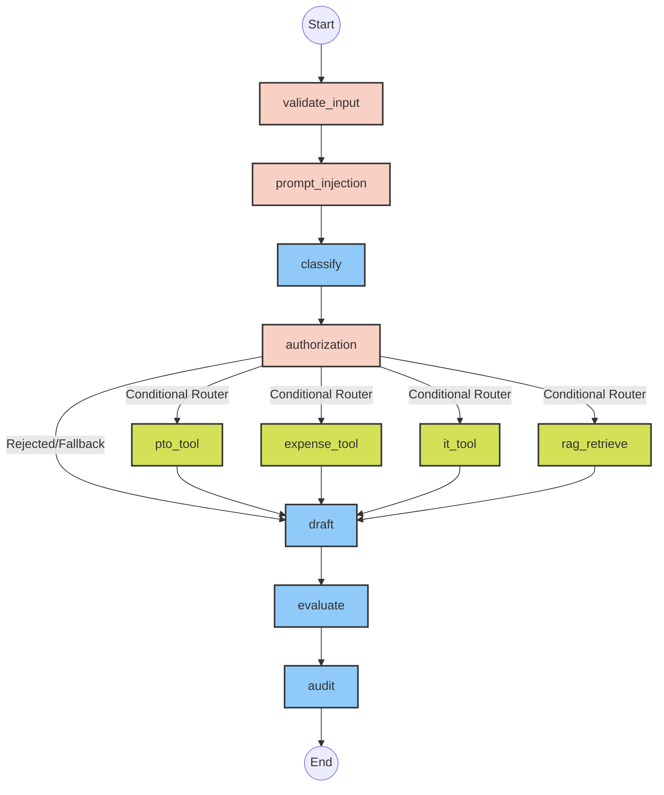

# Enterprise HR AI Agent 🏢🤖

[](https://www.python.org/)
[](https://nextjs.org/)
[](https://fastapi.tiangolo.com/)
[](https://langchain-ai.github.io/langgraph/)
[](https://python.langchain.com/)

## 1. Project Title
**Enterprise HR AI Agent**: A Secure, Agentic Workflow for HR Operations with a Next.js Dashboard.

## 2. Project Overview
This project implements a secure, intelligent, and autonomous HR Artificial Intelligence Agent using a **LangGraph State Machine** wrapped in a **FastAPI backend**, with a modern **Next.js 15 frontend dashboard**. It handles employee queries regarding IT access, expense policies, and PTO balances. The agent is explicitly engineered with robust guardrails, preventing prompt injections, ensuring strict cross-employee data isolation (authorization), and avoiding hallucinations through vector-backed RAG and tool integration.

## 3. Problem Statement
Enterprise AI agents face significant challenges:
1. **Security**: They are vulnerable to prompt injections and jailbreaks.
2. **Data Privacy**: Employees must not be able to query another employee's private information.
3. **Accuracy**: Large Language Models hallucinate. Ground truth must be retrieved dynamically.
4. **Reliability**: Complex pipelines often fail silently. Execution must be observable and resilient.

## 4. Key Features
- **Agentic Orchestration**: Uses LangGraph to manage cyclical state and conditional execution.
- **Next.js Dashboard**: A beautiful, responsive UI to demonstrate the AI workflow in real-time.
- **Strict Security Guardrails**: Regex-compiled input validation blocking data exfiltration, system overrides, and jailbreaks.
- **Zero-Trust Authorization**: Exact word-boundary regex ensuring employees can only query their own data.
- **Vector-RAG Integration**: Serverless Pinecone Vector DB coupled with HuggingFace embeddings.
- **Batch Processing Engine**: Ingests bulk CSV queries, executing graph workflows concurrently.
- **Enterprise Observability**: Native LangSmith tracing for step-by-step debugging.

## 5. System Architecture
The application is split into a **backend** and **frontend**. The backend runs a directed graph where state is passed from node to node. If security or authorization fails, the graph immediately bypasses tools and routes to the drafting node for a refusal. The frontend consumes the FastAPI endpoints to visualize this process.

## 6. LangGraph Workflow



## 7. Folder Structure
```text
.
├── backend/                   # FastAPI & LangGraph Python Backend
│   ├── main.py                # FastAPI Server
│   ├── config.py              # Configuration & dotenv loading
│   ├── graph.py               # LangGraph execution logic
│   ├── nodes/                 # LangGraph nodes (audit, tools, classify, etc.)
│   ├── security/              # Guardrail definitions
│   ├── rag/                   # Document loader & retriever
│   ├── data/                  # Mock databases and policy text files
│   ├── outputs/               # Generated logs and CSV results
│   ├── requirements.txt       # Python dependencies
│   └── .env                   # Backend environment variables
│
└── frontend/                  # Next.js 15 React Frontend
    ├── app/                   # Next.js App Router (Dashboard, Playground, Workflow)
    ├── components/            # Reusable UI components (shadcn/ui)
    ├── services/              # API Axios client
    └── package.json           # Node dependencies
```

## 8. Tech Stack
- **Frontend**: Next.js 15, Tailwind CSS, shadcn/ui, Recharts, TanStack Query
- **Backend**: FastAPI, Uvicorn, LangGraph, LangChain Core
- **LLM Providers**: Groq (Llama-3.3-70b-versatile), OpenAI (GPT-4o-mini)
- **Embeddings**: HuggingFace (`sentence-transformers/all-MiniLM-L6-v2`)
- **Vector Store**: Pinecone Serverless
- **Observability**: LangSmith

## 9. Installation & How to Run

You will need to run both the backend and the frontend simultaneously.

### 1. Start the Backend (FastAPI)
Open a terminal and run:
```bash
cd backend
python -m venv venv

# Windows:
venv\Scripts\activate
# Mac/Linux:
source venv/bin/activate

pip install -r requirements.txt
uvicorn main:app --reload
```
The backend API will run on `http://localhost:8000`.

### 2. Start the Frontend (Next.js)
Open a new terminal and run:
```bash
cd frontend
npm install
npm run dev
```
The frontend dashboard will run on `http://localhost:3000`.

## 10. Environment Variables
Create a `.env` file in the `backend/` directory:
```env
LLM_PROVIDER=groq
GROQ_API_KEY=your_groq_api_key
GROQ_MODEL_NAME=llama-3.3-70b-versatile

# Pinecone Vector RAG Configuration
PINECONE_API_KEY=your_pinecone_api_key
PINECONE_INDEX_NAME=hr-policy-index
PINECONE_ENVIRONMENT=us-east-1

# LangSmith Observability & Tracing
LANGCHAIN_TRACING_V2=true
LANGCHAIN_API_KEY=your_langsmith_api_key
LANGCHAIN_PROJECT=enterprise-hr-ai-agent
```
*(If you do not provide an API key, the backend gracefully degrades to a local MockLLM and offline keyword retrieval.)*

## 11. API Endpoints
The FastAPI backend exposes the following REST endpoints:
- `POST /api/query`: Executes the LangGraph agent for a single query.
- `POST /api/batch`: Processes a bulk CSV upload of queries.
- `GET /api/logs`: Returns historical audit records.
- `GET /api/metrics`: Aggregates usage statistics for the dashboard.
- `GET /api/settings`: Returns system configuration state.

## 12. Security & Authorization
- **Prompt Injection**: Regex patterns detect jailbreaks (`"ignore previous instructions"`), blocking the LLM entirely.
- **Authorization Flow**: Ensures employees can only query their own data via strict regex `\b` boundary matching.

## 13. License
MIT License
